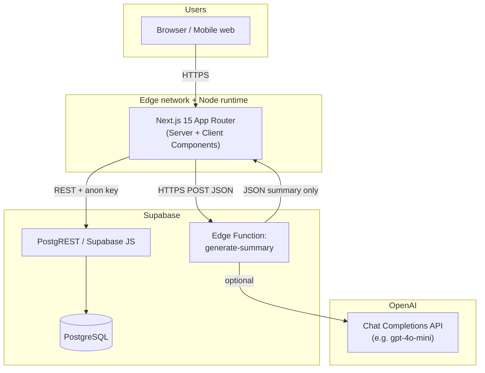
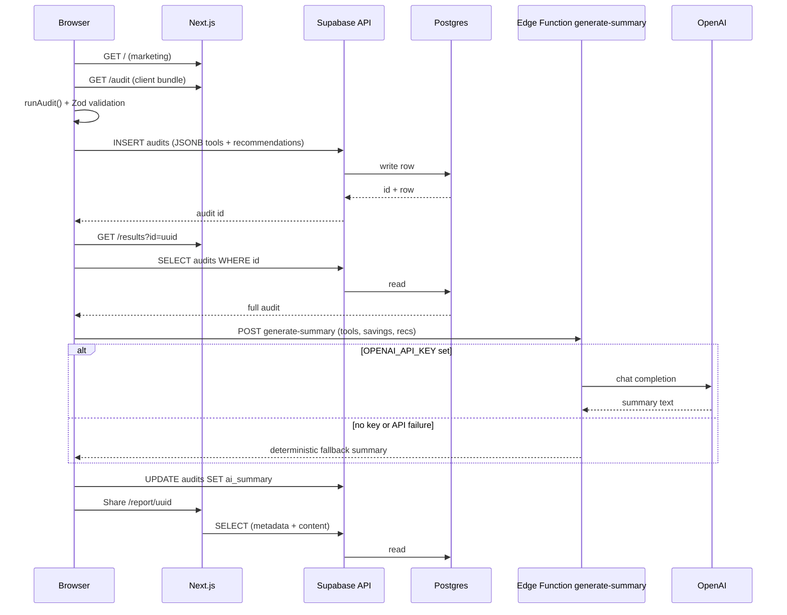
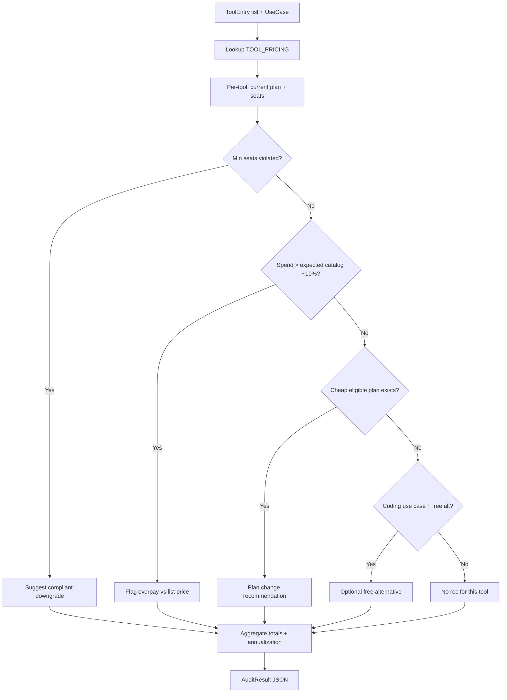
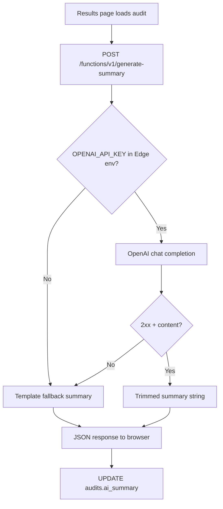
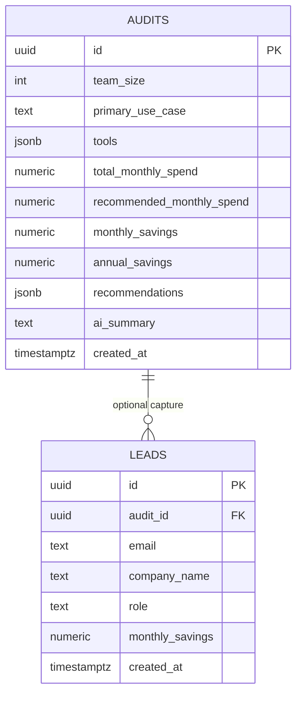

# AI Spend Audit — System Architecture

This document describes how **AI Spend Audit** is structured end to end: clients, deterministic business logic, persistence, optional AI narration, and operational concerns (scale, security, caching, errors).

**Documented stack (product target):** Next.js 15 (App Router), TypeScript, Tailwind CSS, shadcn/ui (Radix primitives), Supabase (Postgres + Edge Functions), OpenAI API.

> **Repo alignment:** Confirm the `next` semver in `package.json` matches your deployment; upgrade to Next 15 when ready—the architectural patterns below (App Router, Server/Client Components, Route Handlers) apply across recent majors.

---

## Table of contents

1. [System context diagram](#system-context-diagram)  
2. [Full data flow](#full-data-flow)  
3. [User flow](#user-flow)  
4. [Audit engine flow](#audit-engine-flow)  
5. [AI summary flow](#ai-summary-flow)  
6. [Database flow](#database-flow)  
7. [Why Next.js](#why-nextjs)  
8. [Why Supabase](#why-supabase)  
9. [Why TypeScript](#why-typescript)  
10. [Scalability plan (~10k audits/day)](#scalability-plan-10k-auditsday)  
11. [Security considerations](#security-considerations)  
12. [Caching strategy](#caching-strategy)  
13. [Error handling strategy](#error-handling-strategy)  
14. [Folder structure](#folder-structure)  

---

## System context diagram

High-level view of actors, the Next.js app, Supabase, and OpenAI.



**Notes:**

- Today’s app path uses the **Supabase JS client** from the browser for `audits` CRUD where configured (anon key + RLS).  
- The **Edge Function** holds **`OPENAI_API_KEY`** server-side; the browser never sees it.  
- **Metadata** for shareable links can be resolved on the **server** (`generateMetadata`) with the same Supabase read path.

---

## Full data flow

End-to-end sequence from landing to shared report (conceptual).



| Stage | Data | Direction |
|--------|------|-----------|
| Form draft | Partial form JSON | `localStorage` only (client) |
| Submit | Normalized tools + engine output + team fields | Browser → Supabase `INSERT` |
| Results | Full audit row | Supabase `SELECT` → client state |
| Summary | Short narrative | Edge Function → optional `UPDATE` |
| Public report | Same row, read-only UI | Server + client reads |

---

## User flow

```mermaid
flowchart LR
  A[Landing /] --> B[/audit]
  B --> C{Valid form?}
  C -->|No| B
  C -->|Yes| D[Insert audit]
  D --> E[/results?id]
  E --> F[Charts + cards]
  E --> G[Optional AI summary]
  E --> H[Copy link → /report/id]
  H --> I[Shared read-only view]
  E -->|High savings| J[Lead capture]
```

- **Progressive disclosure:** Marketing first, audit second, dense analytics last.  
- **No login** for the core loop reduces drop-off; tradeoffs are covered under [Security](#security-considerations).  
- **Share path** intentionally points to **`/report/[id]`** (stable, OG-friendly) rather than the heavier interactive results page.

---

## Audit engine flow

All recommendation math runs in **`lib/audit-engine.ts`** (deterministic, no I/O).



**Outputs:** `total_monthly_spend`, `recommended_monthly_spend`, `monthly_savings`, `annual_savings`, `recommendations[]`, `isEfficient` (threshold-based).

**Reality check:** Catalog prices are **curated**, not live vendor APIs—fast and cheap, but requires periodic human updates.

---

## AI summary flow



- **Secrets:** OpenAI key stays in **Supabase Edge** secrets, not in `NEXT_PUBLIC_*`.  
- **Resilience:** Missing key, HTTP errors, or empty model output all collapse to a **readable fallback** so the UX never hard-fails on “AI down.”  
- **Cost control:** Short prompt, capped `max_tokens`, modest model tier.

---

## Database flow

### Entity relationship (simplified)



### Access pattern (as shipped in migrations)

| Operation | `audits` | `leads` |
|-----------|----------|---------|
| **INSERT** | Allowed to `anon` (create audit / lead) | Allowed to `anon` |
| **SELECT** | Allowed to `anon` (shareable read by UUID) | Allowed to `anon` |
| **UPDATE** | Client updates `ai_summary` after summary | No general update policy in baseline migration |
| **DELETE** | Not exposed to anon in baseline | Cascade from audit delete (DB-level) |

**Indexes:** `audits(created_at)`, `leads(audit_id)` support reporting and lookups at moderate scale.

---

## Why Next.js

| Reason | Detail |
|--------|--------|
| **App Router** | Co-locate layouts, loading states, and **server** metadata (`generateMetadata` for `/report/[id]`). |
| **Hybrid rendering** | Marketing and OG tags can be server-driven; interactive audit/results stay client-driven where needed. |
| **Ecosystem** | First-class React 19 path, image/font optimization, and straightforward deployment to Vercel or Netlify. |
| **Velocity** | One codebase for UI + light API surface; Edge Functions hold vendor-specific AI keys. |

---

## Why Supabase

| Reason | Detail |
|--------|--------|
| **Postgres** | JSONB for `tools` and `recommendations` avoids rigid schema churn early in the product. |
| **RLS** | Row-level policies encode **who can insert/read** without a custom auth service for v1. |
| **Edge Functions** | Deno-isolated functions next to data; ideal OpenAI proxy with CORS and secrets. |
| **Ops** | Backups, connection pooling options, and dashboard reduce backend headcount for a startup. |

---

## Why TypeScript

| Reason | Detail |
|--------|--------|
| **Contracts** | Shared types for `ToolEntry`, `Recommendation`, and audit rows catch drift between engine, UI, and DB shapes. |
| **Refactor safety** | Renaming a field in the audit payload surfaces errors across forms and charts. |
| **Onboarding** | New engineers navigate the codebase via types and editor navigation, not tribal grep knowledge. |

---

## Scalability plan (10k audits/day)

**Rough order of magnitude:** ~10,000 inserts / day ≈ **0.12 sustained writes/sec**, with **10× burst** during campaigns—well within a single Supabase project if configured sensibly.

| Layer | Tactic |
|-------|--------|
| **Postgres** | Keep rows narrow where possible; JSONB is fine at this volume. Add **partial indexes** if you filter hot paths (e.g. `created_at` range dashboards). Use **connection pooling** (Supavisor / pooler) for server-side callers. |
| **Writes** | **Rate limit** audit creation at the edge (Vercel Firewall, Cloudflare, or middleware) to absorb abuse spikes. |
| **Reads** | Public report traffic is read-heavy—consider **read replica** or **cached metadata** if OG scrapers hammer `generateMetadata`. |
| **OpenAI** | **Queue** summary jobs if Edge concurrency or token spend spikes; today’s synchronous path is fine until latency SLOs slip. |
| **App** | **Static generation** for marketing routes; **dynamic** only for audit/results/report. Split large client bundles (e.g. charts) with `dynamic import`. |
| **Observability** | Log insert latency, Edge Function duration, and OpenAI error rate; alert on p95 regression. |

---

## Security considerations

| Topic | Current posture | Hardening options |
|-------|-----------------|-------------------|
| **Anon keys in browser** | Expected for Supabase public clients; **RLS is the real boundary**. | Rotate keys on incident; use **minimal** policies per table. |
| **Shareable audits** | UUID is a **capability URL**; anyone with the link can read that row. | **Signed URLs**, expiring tokens, optional **password**, or **authenticated** reports. |
| **OpenAI key** | Stored only in **Edge Function** env. | Restrict CORS origins from `*` to your production domain; add **JWT verification** or **Supabase signed invocation** if you expose sensitive context later. |
| **PII in leads** | Email stored in `leads`. | Add **TLS-only** enforcement, **retention policy**, and **DSAR** process; tighten `SELECT` on `leads` (often **insert-only** for anon). |
| **Tampering** | Engine runs client-side today. | **Recompute** audit on server (RPC or Route Handler) before `INSERT`, or validate ranges server-side. |
| **Headers / env** | Missing `NEXT_PUBLIC_*` caused subtle fetch failures in the wild. | **Validate at boot** (as in `lib/supabase.ts`) and fail fast in CI if vars absent. |

---

## Caching strategy

| Asset / data | Strategy |
|--------------|----------|
| **Next static chunks** | CDN default on Vercel/Netlify; long `Cache-Control` for hashed assets. |
| **Marketing pages** | Prefer **static** or **ISR** where content rarely changes. |
| **Audit JSON** | **Do not** publicly cache personalized audit responses at shared CDNs unless using **private, short TTL** + auth—stale or leaked audits are worse than a cache miss. |
| **`generateMetadata`** | Optional short **revalidate** if you add ISR for reports; otherwise dynamic is safer for accuracy. |
| **OpenAI** | **No cache** of completions by default; optional dedupe by `(audit_id, prompt_hash)` if you repeat identical requests. |
| **Client** | `localStorage` for **draft** audit form only; cleared after successful submit. |

---

## Error handling strategy

| Surface | Behavior |
|---------|----------|
| **Form** | Zod + React Hook Form: inline field errors, block submit until valid. |
| **Supabase insert (audit)** | `try/catch`; log; reset submitting state; optional toast (user-visible message recommended in product polish). |
| **Supabase read** | Distinguish “not found” vs network error; empty state on `/results` when ID missing. |
| **Edge Function** | Always return JSON; use **fallback summary** on missing key or OpenAI failure; avoid 500 without body for easier client handling. |
| **Summary persistence** | Client update failure should not erase on-screen summary—log and optionally retry with backoff. |
| **Config** | Throw on missing public env at module init to avoid cryptic **`Headers: Invalid value`** class errors. |

---

## Folder structure

Logical ownership of code paths (aligned with this repository).

```
app/
  page.tsx                 # Marketing landing
  layout.tsx               # Global layout, fonts, metadata defaults
  audit/page.tsx           # Client: form, runAudit, INSERT audit
  results/page.tsx         # Client: SELECT audit, charts, summary POST, UPDATE ai_summary
  report/[id]/
    page.tsx               # Server: generateMetadata (Supabase read)
    report-content.tsx     # Client: read-only report UI

components/
  ui/                      # shadcn/Radix primitives (buttons, cards, selects, …)
  *.tsx                    # Feature sections (navbar, hero, charts wrappers, lead form)

lib/
  audit-engine.ts          # Deterministic pricing + recommendations
  supabase.ts              # createClient + env validation + SUPABASE_URL export
  types.ts                 # Shared domain types
  utils.ts                 # Small shared helpers

supabase/
  migrations/*.sql         # Schema + RLS
  functions/generate-summary/
    index.ts               # OpenAI + fallback + CORS

hooks/                     # Client-only hooks (e.g. toasts)
```

**Principle:** **`app/`** owns routing and composition; **`lib/`** owns pure logic and integrations; **`components/`** owns reusable UI; **`supabase/`** owns infrastructure-as-code for data and Edge.

---

## Related reading

- [`readme.md`](./readme.md) — setup, env vars, product overview.  
- [`supabase/migrations/`](./supabase/migrations/) — authoritative RLS and schema.  

---

*Last updated to reflect the AI Spend Audit architecture and extension path; adjust diagrams when you add auth, server-side recompute, or job queues.*
